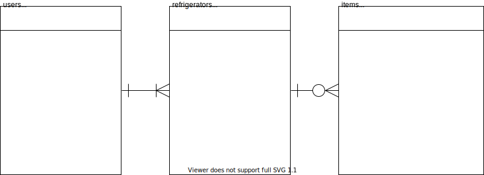

# 冷蔵庫管理ツール
冷蔵庫を開けなくてもどこに何が入っているのかがわかるようにするツールです。

---

## データベース
### ER図

---

## API
|メソッド|URI|アクション|備考|
|:--|:--|:--|:--|
| GET\|HEAD  | api/item                        | App\Http\Controllers\ItemController@index                  |認証|
| POST      | api/item                        | App\Http\Controllers\ItemController@store                  |認証|
| GET\|HEAD  | api/item/{item}                 | App\Http\Controllers\ItemController@show                   |認証|
| PUT\|PATCH | api/item/{item}                 | App\Http\Controllers\ItemController@update                 |認証|
| DELETE    | api/item/{item}                 | App\Http\Controllers\ItemController@destroy                |認証|
| POST      | api/login                       | App\Http\Controllers\Auth\Api\LoginController@login        |認証|
| POST      | api/logout                      | App\Http\Controllers\Auth\Api\LoginController@logout       ||
| GET\|HEAD  | api/refrigerator                | App\Http\Controllers\RefrigeratorController@index          |認証|
| POST      | api/refrigerator                | App\Http\Controllers\RefrigeratorController@store          |認証|
| GET\|HEAD  | api/refrigerator/{refrigerator} | App\Http\Controllers\RefrigeratorController@show           |認証|
| PUT\|PATCH | api/refrigerator/{refrigerator} | App\Http\Controllers\RefrigeratorController@update         |認証|
| DELETE    | api/refrigerator/{refrigerator} | App\Http\Controllers\RefrigeratorController@destroy        |認証|
| POST      | api/register                    | App\Http\Controllers\Auth\Api\RegisterController@register  ||
| GET\|HEAD  | api/user                        | Closure                                                    |認証|